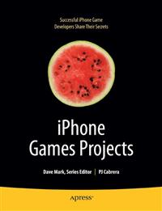

# Apress Source Code

This repository accompanies [*iPhone Games Projects*](http://www.apress.com/9781430219682) by PJ Cabrera, Joachim Bondo, Brian Greenstone, Mike Lee, Jamie Gotch, Michael Kasprzak, Richard Zito, Matthew Aitken, Olivier Hennessy, and James Lee (Apress, 2009).

Download the files as a zip using the green button, or clone the repository to your machine using Git.

## Releases

Release v1.0 corresponds to the code in the published book, without corrections or updates.

## Contributions

See the file Contributing.md for more information on how you can contribute to this repository.
